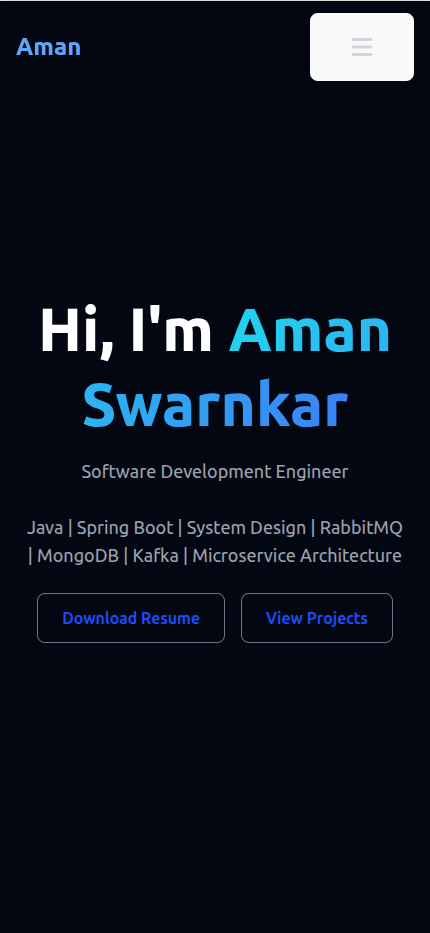
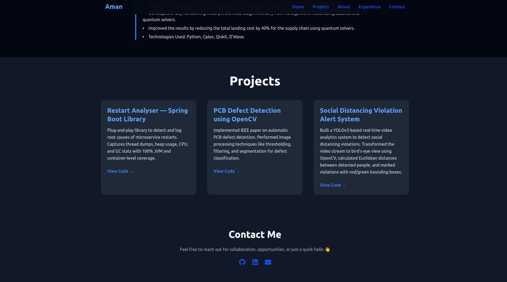
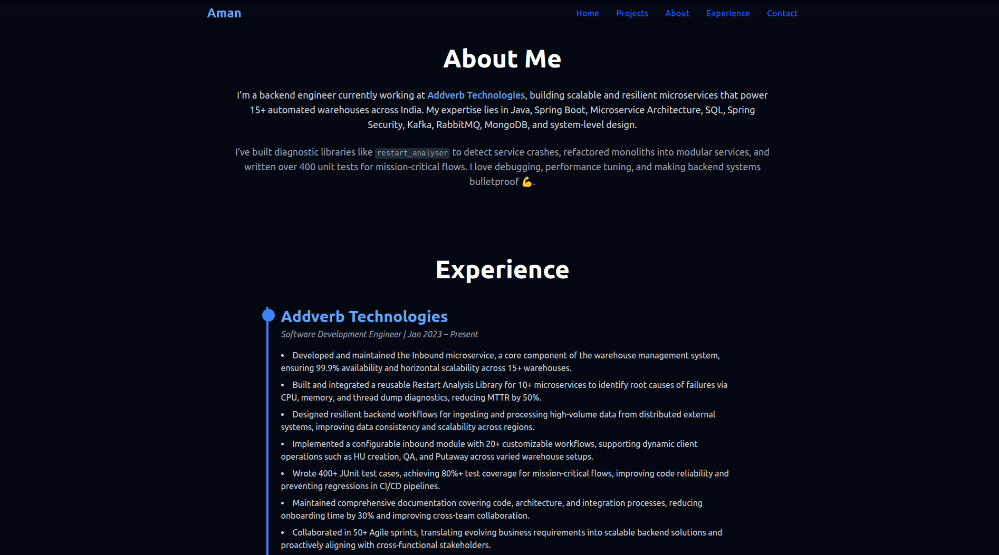

# 🚀 Aman Swarnkar — Portfolio

Welcome to my personal developer portfolio!  
This website showcases my skills, experience, and projects.  
Built with ❤️ using **React**, **Vite**, and **TailwindCSS**, and fully responsive for all devices.

---

## 🌟 Live Demo
🔗 [View Portfolio](https://portfolio-beta-umber-35.vercel.app/)

---

## 📷 Screenshots

| Desktop | Mobile |
|---------|--------|
|  |  |


| Projects | Experience |
|----------|--------|
|  |  |

---

## 📋 Features

✅ Responsive design — works on desktop, tablet, and mobile  
✅ Dark mode support  
✅ Smooth scrolling navigation  
✅ Projects section with highlights  
✅ Resume download button  
✅ Mobile-friendly hamburger menu

---

## 🛠️ Tech Stack

- React + Vite
- TailwindCSS
- JavaScript (ES6+)
- React Icons
- Deployed on: **Vercel**

---

## 📁 Folder Structure

```
my-portfolio/
├── public/
│   └── resume.pdf
├── src/
│   ├── components/
│   │   ├── Hero.jsx
│   │   ├── Navbar.jsx
│   │   ├── Projects.jsx
│   │   └── Footer.jsx
│   ├── App.jsx
│   ├── index.css
│   └── main.jsx
├── package.json
├── tailwind.config.js
└── vite.config.js
```

---

## 👨‍💻 Author

**Aman Swarnkar**  
📧 [amanswarnkar2001@gmail.com](mailto:amanswarnkar2001@gmail.com)  
🔗 [LinkedIn](https://www.linkedin.com/in/aman-swarn/)  
🔗 [GitHub](https://github.com/amansoni000)

---

## 🚀 Setup & Run Locally

Clone the repository:
```bash
git clone https://github.com/amansoni000/Portfolio.git
cd Portfolio
```

Install dependencies:
```bash
npm install
```

Run the development server:
```bash
npm run dev
```

Build for production:
```bash
npm run build
```

Preview production build:
```bash
npm run preview
```
